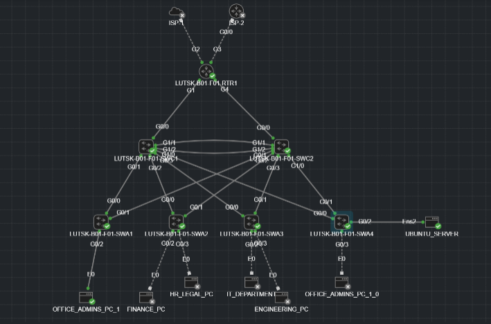

# Enterprise Branch Network Deployment (Cisco & Linux)

## 📌 Project Overview
This project simulates a fully functional **Enterprise Branch Network** designed and deployed using **Cisco Modeling Labs (CML)**.

The objective was to build a scalable, segmented, and secure network infrastructure from scratch. The topology integrates **Cisco IOS routing/switching** with a **Linux-based infrastructure server** (Ubuntu) to provide core services like DHCP.

Key highlights include strict **VLAN segmentation**, **OSPF routing**, **NAT for WAN access**, and **Hardened Security Policies** (ACLs) that restrict management access while maintaining service availability.



---

## 🛠 Technologies & Tools Used
* **Platform:** Cisco Modeling Labs (CML)
* **Routing & Switching:** Cisco IOS (L2/L3 Switching, OSPF Area 0, NAT).
* **Infrastructure Services:** Ubuntu Linux 24.04 LTS, `isc-dhcp-server`.
* **Security:** Extended Access Control Lists (ACLs), SSH Management.


---

## 🏗 Network Design

### VLAN & Addressing Scheme
The network is segmented into functional departments to minimize broadcast domains and enforce security boundaries.

| VLAN ID | Name            | Subnet          | Gateway      | Notes |
| :---    | :---            | :---            | :---         | :--- |
| **10** | OFFICE_ADMINS   | 10.5.10.0/24    | 10.5.10.1    | Standard Lease (8h) |
| **20** | FINANCE         | 10.5.20.0/24    | 10.5.20.1    | Secured Segment |
| **30** | HR_LEGAL        | 10.5.30.0/24    | 10.5.30.1    | Secured Segment |
| **40** | ENGINEERING     | 10.5.40.0/24    | 10.5.40.1    | High Bandwidth |
| **50** | SERVERS         | 10.5.50.0/24    | 10.5.50.1    | **Restricted Access** |
| **60** | IT_DEPARTMENT   | 10.5.60.0/24    | 10.5.60.1    | **Management Access** |
| **70** | MANAGEMENT      | 10.5.70.0/24    | 10.5.70.1    | Static Only (No DHCP) |
| **80** | GUEST           | 10.5.80.0/24    | 10.5.80.1    | Short Lease (1h) |

---

## 🚀 Key Implementations & Challenges

### 1. Centralized DHCP on Linux (Ubuntu)
Instead of using Cisco routers for DHCP, I deployed a dedicated Ubuntu Server running `isc-dhcp-server`.
* **Configuration:** Custom scopes defined in `/etc/dhcp/dhcpd.conf`.
* **Challenge:** Enabling DHCP clients across different VLANs to reach the server.
* **Solution:** Configured **IP Helper Addresses** (`ip helper-address 10.5.50.10`) on the Core Switch SVIs to relay broadcast traffic as unicast to the server.

### 2. Security Segmentation (ACLs)
A critical requirement was to prevent standard users (HR, Finance, Guests) from accessing the Server VLAN, while strictly allowing the IT Department full management access.

* **The Problem:** Blocking "All Traffic" from User VLANs to Server VLANs accidentally blocked **DHCP Requests** (UDP Port 67), causing clients to fail IP addressing.
* **The "Pin-Hole" Solution:** Implemented an Extended ACL that explicitly permits DHCP traffic before the Deny statement.

**Code Snippet (Core Switch):**
```cisco
ip access-list extended RESTRICT_USERS
 ! Allow IT Department full access
 permit ip 10.5.60.0 0.0.0.255 any
 
 ! CRITICAL: Allow DHCP Requests to pass through to Server
 permit udp any host 10.5.50.10 eq bootps
 
 ! Deny all other VLANs from accessing Server Subnet
 deny   ip 10.5.0.0 0.0.255.255 10.5.50.0 0.0.0.255
 
 ! Permit Internet/WAN traffic
 permit ip any any

### 3. Layer 2 Security Hardening
Implemented Layer 2 security features at the access edge to protect against spoofing and unauthorized network access.

* **DHCP Snooping:** Configured on access switches to build a trusted IP-to-MAC binding database.
  * *Challenge:* Enabling Snooping on the Core Switch interfered with its `ip helper-address` (DHCP Relay) process, causing it to drop `DHCPDISCOVER` broadcasts.
  * *Solution:* Removed Snooping from the Core to allow standard relay routing. Enforced Snooping strictly at the Access Layer and configured trunk uplinks as `trusted` to allow server replies.
* **Dynamic ARP Inspection (DAI):** Enabled on user VLANs to prevent ARP poisoning by validating packets against the DHCP Snooping database. Trunk uplinks were configured as `trust` ports to ensure legitimate default gateway ARP replies from the Core Switch are not dropped.
* **Port Security:** Locked down user-facing access ports to prevent unauthorized device connections.
  * Restricted ports to `maximum 1` MAC address.
  * Enabled `mac-address sticky` to retain the learned MAC in the running configuration.
  * Configured `violation restrict` to drop unauthorized traffic and log the event without putting the physical port into an error-disabled state.